# 1. docker

## 1.1. 基本概念

* 虚拟化：指将单台物理计算机虚拟成多台逻辑计算机使用，逻辑计算机能完整地模拟物理计算机的计算过程，并相互隔离地共享物理计算机的资源
* docker：是一种基于进程的轻量级虚拟化解决方案。轻量级是指docker无需底层硬件支持（hypervisor），同时无需真正安装一套完整的操作系统，仅依赖进程即可模拟计算机
* docker依赖于3项linux内核技术：
	1. namespace：将操作系统内核资源封装并按namespace分配，不同namespace下的进程只能使用该namespace下的内核资源，以实现进程间操作系统内核资源的隔离
		* UTS namespace：隔离主机名和域名
		* IPC namespace：隔离进程间通信的信号量、消息队列（System V，POSIX）
		* PID namespace：隔离进程ID
		* Mount namespace：隔离挂载点
		* Network namespace：隔离网络资源（虚拟网卡、IP表、路由规则、端口号等）
		* User namespace：隔离用户和用户组
	2. control group（cgroup）：限制或隔离进程对计算机硬件资源的使用
		* cpu：限制进程的CPU占用
		* cpuset：为进程分配指定的CPU和内存节点（隔离）
		* cpuacct：统计各cgroup的CPU占用情况
		* memory：限制进程的内存占用
		* blkio：限制进程对阻塞IO的占用（磁盘读写等）
		* net_cls：限制进程的网络带宽（不直接控制网络IO，而是给数据包打标，然后交由流控机制处理限速）
		* net_prio：设置进程的网络流量优先级（同上）
		* devices：设置进程对设备的访问权限
		* freezer：挂起或恢复进程
	3. union filesystem（unionFS）：允许将多个（可能位于不同物理位置）的目录及其内容合并后联合挂载到同一目录下。docker默认使用的是overlayfs（overlay2），它在unionFS的基础上引入了有序的层（layer）的概念，使容器内的虚拟操作系统搭建文件系统的过程是一个增量的层堆叠的过程：
		* 最底层：由docker官方提供的scratch镜像，用于模拟操作系统的bootfs和kernal
		* 次底层：由各linux发行版本基于scratch镜像制作并提供，用于模拟操作系统的rootfs，通常包含/bin, /dev, /etc, /home, /opt, /proc, /root, /usr, /var等经典目录；普通用户一般都在Dockerfile中基于（FROM关键字）这一层开始进行镜像的制作
		* 从第三层开始：是用户在制造镜像时（Dockerfile）自定义的目录；Dockerfile中除了FROM外，每一行都是一层；docker在存储时，每一层都会作为一个单独的目录被打包、标记（SHA2）并存储，以便有机会充分复用每一层
		* 所有层的数据包及其顺序清单就是镜像，按照镜像加载到内存中的运行时环境就是容器

## 1.2. 进程模型

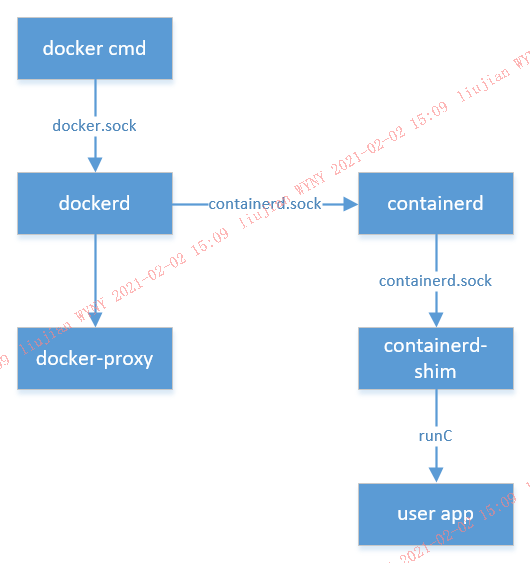

* dockerd：docker的守护进程，与docker命令行之间形成C/S结构，负责接收docker命令，和实际管理docker各组件，如镜像、容器、网络、挂载卷等；与docker命令行及其它客户端之间，通过docker.sock的RPC接口进行通信
* containerd：容器运行时的守护进程，负责管理容器运行时的所有进程，是所有容器运行时进程的最上级父进程；dockerd通过containerd.sock的RPC接口向containerd下发容器操作的命令
* containerd-shim：containerd进程的子进程，是单个容器的载体，容器内应用进程的父进程；它在containerd与应用程序之间起到一个垫片（shim）的作用，使应用程序与容器平台完全解耦：
  * 包含容器的元数据，如ID、名称、镜像、应用程序运行命令、实际工作路径等
  * 与containerd之间通过containerd.sock的RPC接口通信，接收container的的命令，并实时上报应用程序的状态
  * 调用runC工具包，由runC根据OCI的标准来完成对容器内应用程序进程的操作，如应用子进程的启停、镜像的拉取与目录的整合、namespace和cgroup的创建，等

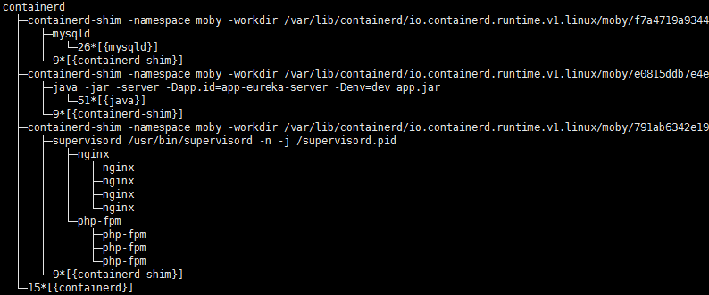

## 1.3. 网络模型

### 1.3.1. 容器网络

| 模式         | docker run参数             | 说明                                                         |
| ------------ | -------------------------- | ------------------------------------------------------------ |
| bridge       | 缺省配置<br>或--net=bridge | 拥有独立的Network namespace，通过网桥docker0，及虚拟网卡设备veth pair，搭建一个宿主机内部局域网 |
| host         | --net=host                 | 使用宿主机默认的Network namespace，因而容器内的应用进程可以与其它普通进程一样直接使用宿主机的网络资源 |
| container    | --net=container:{name/ID}  | 使用指定容器的Network namespace，该模式下两容器内的应用进程共享网络资源，并且可以通过lo网卡（127.0.0.1/localhost）相互直接通信 |
| none         | --net=none                 | 拥有独立的Network namespace，但除了lo网卡外，未配置其它任何网络设备，因此容器内的应用进程无法对外联网，需用户自行人工配置 |
| user-defined | --                         | 通过docker network create -d命令，选择网络驱动，创建自定义的容器网络；通常与none模式配合使用。官方提供的网络驱动有3种：bridge, overlay, macvlan；并支持其它第三方容器网络驱动插件 |

#### 1.3.1.1. 桥接（bridge）模式

##### 1.3.1.1.1. 名词解释

* 虚拟网桥（linux bridge）：linux内核功能，类似于物理交互机，作用于数据链路层，通过MAC地址学习机制，将数据包路由到加入本网桥的目标网络接口
* 虚拟网卡设备veth pair：linux虚拟网络接口的一种，成对出现，两端互通，即从一个veth进入的数据，必然从对端的veth出来；通常用于两个Network namespace间的数据传输

##### 1.3.1.1.2. 组网拓扑

* dockerd进程启动时，会创建一个虚拟网桥，命名为docker0，并为docker0分配一个私有IP及子网掩码（通常是172.17.0.1/16，可通过`ifconfig`命令查看），从而得到一个专属于容器的docker0子网（172.17.0.0/16）；然后将该子网注册到宿主机的路由表中，如：

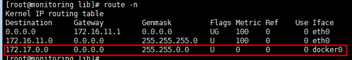

* 容器启动时，runC工具集会在宿主机上创建一对虚拟网卡设备veth pair
  * 将veth pair的一端放入容器进程的Network namespace中，命名为eth0，从docker0子网中为其分配一个未使用的IP，并将其默认网关设为docker0的IP
  * 将veth pair的另一端放入宿主机默认的Network namespace中，命名为veth + {多位随机字符}，并将其加入docker0网桥中（可通过`brctl show`命令查看）

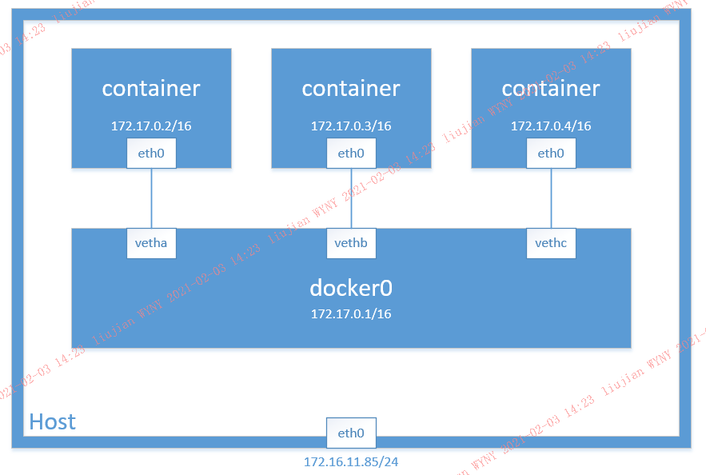

##### 1.3.1.1.3. 传输路径

###### 1.3.1.1.3.1. 容器间访问

在容器A内（如172.17.0.2/16的容器），访问容器B的IP（如172.17.0.3/16）：

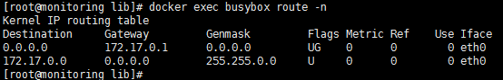

* 根据容器内的路由表（见上），二者属于同一子网，数据直接发送到容器A内的eth0网卡

* 数据从容器A的eth0流入，从对端的vetha流出，进入docker0网桥；由于目标地址（172.17.0.3/16）属于docker0子网，因此网桥启动交换机的功能，将数据转发到vethb网卡

* 数据从vethb流入，则从其对端，即容器B的eth0流出，从而进入容器B中

###### 1.3.1.1.3.2. 容器内访问容器外

在容器内（如172.17.0.2/16的容器），访问容器外的IP（如内网IP：172.16.11.68，或公网IP：106.11.253.86）：

* 根据容器内的路由表，源地址与目标地址不属于同一子网，因此通过容器内的eth0网卡直接将数据转发给网关（172.17.0.1）
* 数据从容器的eth0进入，从对端的vetha流出，进入docker0；此时目标地址不属于docker0子网，docker0启动网关的功能，查看宿主机的路由表：
  * 若目标地址与宿主机同子网（如目标地址为内网IP：172.16.11.68），则直接通过宿主机的eth0网卡转发给目标地址
  * 若目标地址与宿主机不同子网（如目标地址为公网IP：106.11.253.86），则通过宿主机的eth0网卡转发给宿主机的网关，由宿主机的网关决定去向

###### 1.3.1.1.3.3. 宿主机访问容器

在容器所在的宿主机上，访问容器的IP（如172.17.0.2/16）：

* 根据宿主机的路由表，目标地址属于172.17.0.0/16网段，因此数据被转发给docker0网桥
* 数据进入docker0后，由于目标地址属于docker0的子网，因此网桥启动交互机的功能，将数据转发到vetha网卡
* 数据从vetha流入，则从其对端，即容器的eth0流出，从而进入容器中

###### 1.3.1.1.3.4. 其它主机访问容器

由于172.17.0.0/16网段是配置在本宿主机内部的局域网，未配置到外部的交互机或路由器中，因此外部的其它主机无法通过该网段访问到本宿主机，进而也无法通过172.17.0.0/16网段访问到本宿主机内的容器

其它主机若要访问到本宿主机上的容器，必须通过宿主机端口映射的方式（见1.3.2）

### 1.3.2. 端口映射

容器内的进程如果想要被其它主机访问到，一般可通过2种方式：

* 使用**host模式**：容器与宿主机共享Network namespace，因而容器可以直接使用宿主机的网络资源，容器内的进程直接绑定宿主机的端口，对外暴露服务
* 端口映射：通过`docker run`命令的`-p`参数，或者`docker port`命令，将容器内进程的端口号映射到宿主机的指定端口号，从而当访问宿主机的指定端口号时，通过NAT机制，将数据转发给容器进程的端口

#### 1.3.2.1. iptables NAT

docker一般使用iptables的NAT机制来实现端口映射功能

##### 1.3.2.1.1. iptables简介

下图是对iptables的简单介绍：

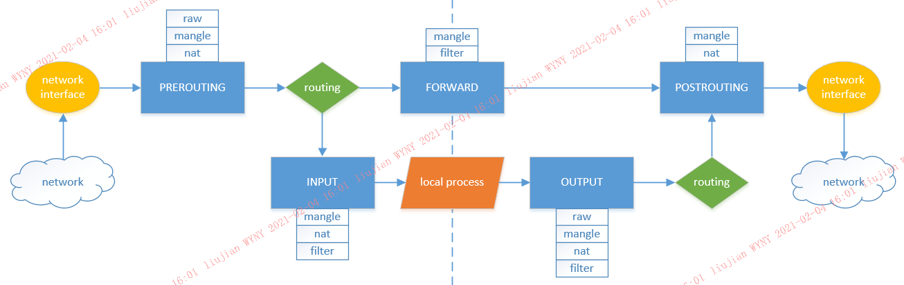


通常，iptables包含“四表五链”：

* 四表（优先级自上而下）：
  * raw：是否对数据包进行状态追踪
  * mangle：拆解数据包，修改数据包，并重新封装，通常用于打标
  * nat：网络地址转换，修改数据包的源地址（SNAT）或目的地址（DNAT）
  * filter：数据包过滤（放行、丢弃或拒绝）
* 五链：
  * PREROUTINE：路由判断前
  * INPUT：本地进程处理前
  * OUTPUT：本地进程处理后
  * FORWARD：转发
  * POSTROUTING：路由判断后

iptables规则需要指定表与链，以及数据包的匹配条件和处理方式，从而实现在指定的阶段，对满足匹配条件的数据包，做出预定义的处理。其中：

* 表定义了处理方式的大类，并包含了具体的处理方式，如filter表包含了ACCEPT、DROP、REJECT等方式，nat表包含了SNAT、DNAT、MASQUERADE等方式；具体的处理方式通常在iptables规则中使用`-j`参数指定
* 链定义了执行处理的阶段
* 匹配条件通过其它参数指定，如`-s`参数表示源地址，`-d`表示目的地址，`-p`表示协议，`-i`表示数据包进入的网口，`-o`表示数据包流出的网口，等等

与docker的端口映射相关的只有**nat**表，因此按nat表对iptables的处理流程进行精简，得下图：

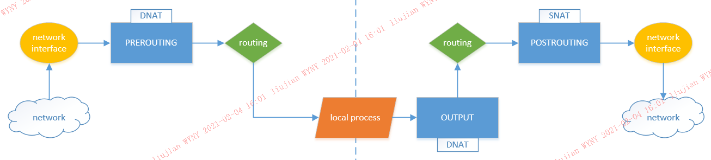

注意：

* 由于 nat + INPUT 的规则并没有被各linux发行版本广泛支持（如CentOS从7.0才支持开始），因此docker为了保证兼容性，并未使用 nat + INPUT 规则
* PREROUTING和OUTPUT链在路由判断之前，因此是目的地址转换（DNAT）；POSTROUTING链在路由判断后，因此是源地址转换

##### 1.3.2.1.2. docker的nat表初始化

dockerd进程启动时，会在iptables的nat表中插入如下的规则：

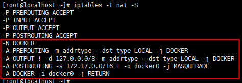

其含义为：

```
-N DOCKER
```

新建一个DOCKER链，该链将用于端口映射的NAT（见1.3.2.1.3）

```
-A PREROUTING -m addrtype --dst-type LOCAL -j DOCKER
```

`-m addrtype --dst-type LOCAL`参数表示数据包的目的地址为本地地址（可通过`ip route show table local type local`命令查看，如127.0.0.0/8，宿主机的IP、172.17.0.1等都是本地的地址），因此该规则的含义是：在路由判断前，若目的地址为本地地址，则交给DOCKER链处理

```
-A OUTPUT ! -d 127.0.0.0/8 -m addrtype --dst-type LOCAL -j DOCKER
```

数据包经本地进程处理后，若目的地址不属于127.0.0.0/8子网，但目的地址又是本地地址（宿主机IP、172.17.0.1等），则交给DOCKER链处理

```
-A POSTROUTING -s 172.17.0.0/16 ! -o docker0 -j MASQUERADE
```

`-j MASQUERADE`参数是一个特殊的SNAT，表示将数据包的源地址改为数据包流出的网口的地址，因此该规则的含义是：在路由判断后，若数据包的源地址属于172.17.0.0/16子网，但数据包不从docker0流出（只能从eth0或lo流出），则将数据包的源地址改为宿主机的IP（从eth0流出）或127.0.0.1（从lo流出）

```
-A DOCKER -i docker0 -j RETURN
```

在DOCKER链中，若数据包从docker0流入，则直接返回原链，不再匹配DOCKER链中剩余的规则

##### 1.3.2.1.3. 端口映射的nat规则

当使用`docker run`命令的`-p`参数，或`docker port`命令，为容器端口与宿主机端口设置映射关系，例如：

```
将容器（IP：172.17.0.2）的80端口，映射到宿主机的30000端口
```

dockerd会在iptables的nat表中插入如下的规则：

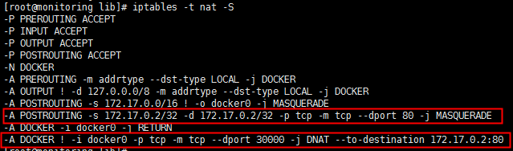

其含义为：

```
-A POSTROUTING -s 172.17.0.2/32 -d 172.17.0.2/32 -p tcp -m tcp --dport 80 -j MASQUERADE
```

路由判断后，若数据包协议为TCP，且源地址是172.17.0.2/32，目的地址是172.17.0.2/32，目的端口号（dport）为80，则将数据包的源地址改为流出的网口的地址

```
-A DOCKER ! -i docker0 -p tcp -m tcp --dport 30000 -j DNAT --to-destination 172.17.0.2:80
```

在DOCKER链中，若数据包不从docker0流入，且数据包协议为TCP，目的端口号为30000，则将数据包的目的地址改为172.17.0.2:80

##### 1.3.2.1.4. 总结

综上，根据dockerd在初始化和端口映射时为iptables添加的规则，iptables NAT的处理流程，如下图：

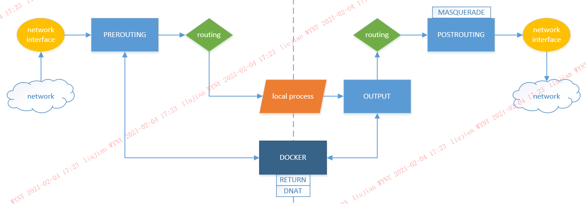

其中：

* 虚线的左侧为数据接收侧，数据包从网口（eth0/docke(⊙o⊙)…r0/lo等）进入，最终进入本地进程；数据包的源地址为客户端的地址，目的地址为本地地址（eth0: 宿主机IP，docker0: 172.17.0.1，lo: 127.0.0.1，等）
* 虚线的右侧为数据发送侧，数据包从本地进程发出，最终通过网口进入网络；数据包的源地址为本地地址，目的地址为客户端的地址

数据接收过程：

1. 数据包从网口进入后，路由判断前（PREROUTING），若数据包的目的地址为本地地址，则跳转到DOCKER链
     1. 若数据包从docker0流入（说明数据包的目的地址是172.17.0.1），则直接返回PREROUTING链，不再匹配DOCKER剩余的规则
     2. 若数据包不从docker0流入（说明数据包的目的地址为宿主机IP或127.0.0.1），且数据包协议为TCP，目的端口号为30000，则将数据包的目的地址改为172.17.0.2:80（容器的地址）
  2. 路由
  3. 本地进程处理

数据发送过程：

  1. 数据包从本地进程发出后，路由判断前（OUTPUT），若数据包的目的地址不属于127.0.0.0/8（lo）子网，但目的地址又是本地地址（说明要么是宿主机IP，要么是172.17.0.1），则跳转到DOCKER链
       1. 若数据包从docker0流入，则直接返回OUTPUT链，不再匹配DOCKER剩余的规则；但此时数据包刚从本地进程中发出，还未经过网口，因此本条规则肯定不会被匹配到
       2. 若数据包不从docker0流入，且数据包协议为TCP，目的端口号为30000，则将数据包的目的地址改为172.17.0.2:80；由于此时数据包未经过网口，因此不从docker0流入的条件必然满足；同时，由于网桥docker0（172.17.0.1）并没有创建30000端口的socket，且应用进程不会直接将数据包的目的地址设为网桥的地址，因此本条规则通常只会被目的地址是宿主机IP、端口号为30000的TCP数据包匹配到
2. 路由
3. 数据包经过路由判断后（POSTROUTING）：
      1. 若源地址属于172.17.0.0/16子网，但数据包不从docker0流出（只能从eth0或lo流出），则将数据包的源地址改为流出的网口的地址；本条规则匹配的是容器内发送数据到容器外的场景，将源地址从容器的IP伪装（MASQUERADE）成宿主机的IP，目的是对外隐藏容器网络的存在，使外部网络不感知容器；注意，该规则与端口映射无关
      2. 若数据包协议为TCP，且源地址是172.17.0.2/32，目的地址是172.17.0.2/32，目的端口号（dport）为80，则将数据包的源地址改为流出的网口的地址；本条规则匹配的是容器发送数据给自己的场景，将源地址从容器自身的IP伪装成宿主机的IP，它是对上一条规则的补充
4. 数据包从指定网口流出

总的来说：

iptables NAT在docker中起了两个作用：

* 以DOCKER链为核心，结合路由判断前的PREROUTING链和OUTPUT链，实现了目的地址从宿主机地址（宿主机IP + 宿主机端口）到容器地址（容器IP + 容器端口）的转换（DNAT）
* 以POSTROUTING链为核心，实现了源地址从容器地址到宿主机地址的伪装（MASQUERADE），使容器网络不被感知

#### 1.3.2.2. docker-proxy

仔细观察上面的iptables NAT规则可以发现，在OUTPUT链中，排除了目的地址属于127.0.0.0/8子网，即lo回环网络的情况

默认情况下，docker通过docker-proxy进程来处理通过lo回环网络映射到容器网络的情况，如127.0.0.1:30000跳转到172.17.0.2:80

如1.2的进程模型所示，docker-proxy是dockerd守护进程的子进程，它的启动命令例如：

```
/usr/bin/docker-proxy -proto tcp -host-ip 0.0.0.0 -host-port 30000 -container-ip 172.17.0.2 -container-port 80
```

docker-proxy是一个基于golang实现的小程序，大小不到3MB。功能主要是建立一个socket，绑定监听指定的宿主机端口，将接收是数据直接透传给指定的容器地址

根据访问地址的不同，在宿主机上对同一个容器内的应用进程，可以有三种访问方式：

* eth0 IP + 宿主机端口（如172.16.11.85:30000）：iptables NAT
* lo IP + 宿主机端口（127.0.0.1:30000）：docker-proxy
* 容器IP + 容器端口（172.17.0.2:80）：路由表

##### 1.3.2.2.1. 禁用iptables

从docker-proxy的启动命令可以看出，它针对的IP不仅仅是lo回环地址，任何本机的以太网IP，它都能支持。因此完全使用docker-proxy来替代iptables NAT是可行的

一些特殊的场景下（如安全性要求较高），需要禁止程序对iptables的修改。docker也支持这个需求：在dockerd的启动参数中添加`--iptables=false`，即可禁止docker对iptables的修改。此时，docker-proxy将完全承担起从宿主机端口（无论哪个本地地址）映射到指定容器地址的责任

但是，由于iptables的filter表还承担着容器网络隔离（如多个自定义桥接网络，略）的功能，因此通常都不会禁用iptables

##### 1.3.2.2.2. 禁用docker-proxy

docker也允许禁用docker-proxy：在dockerd的启动参数中添加`--userland-proxy=false`，即可禁止dockerd父进程创建docker-proxy子进程

此处，iptables NAT将承担起对lo回环地址的端口映射，因此iptables规则也会有所变化，例如：

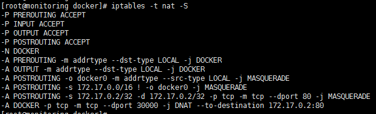

# 2. kubernetes

## 2.1. 基本概念

* kubernetes：简称k8s，是一套容器编排解决方案。容器编排是指自动化地调度、部署、扩展容器应用，包括进程、网络、挂载设备、配置、资源等。主要应用于多主机集群场景下，解决了docker单节点带来的跨主机多副本部署难、网络配置难等问题（后来docker官方跟风推出了docker-compose和docker-swarm，但为时已晚，k8s已经成为容器编排的事实标准）
* k8s的核心组件包括：
  * master
    * api-server
    * controller manager
    * scheduler
  * node
    * kubelet
    * kube-proxy
  * etcd
  * kubectl
  * others
    * kube-dns


